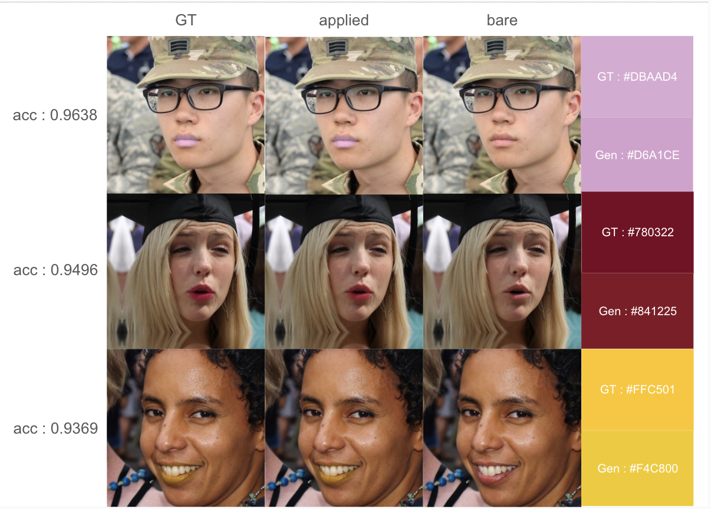
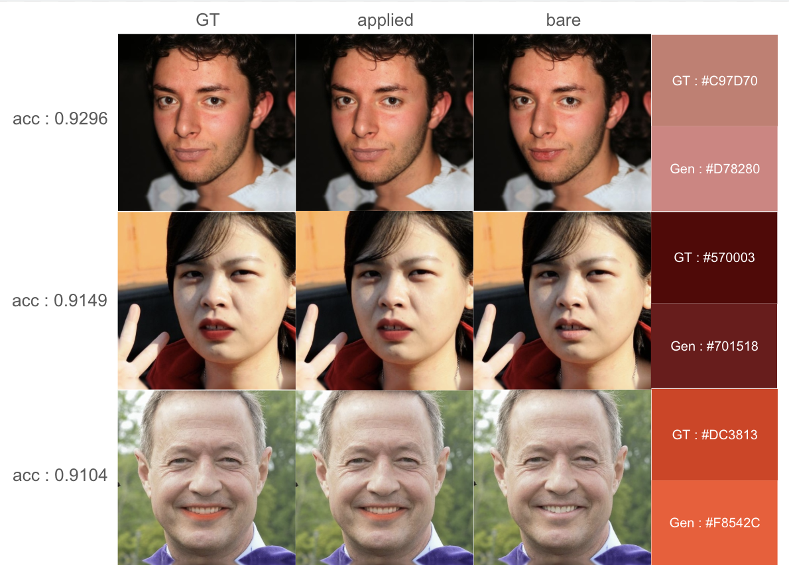
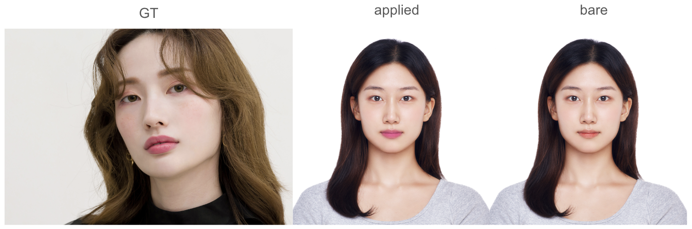
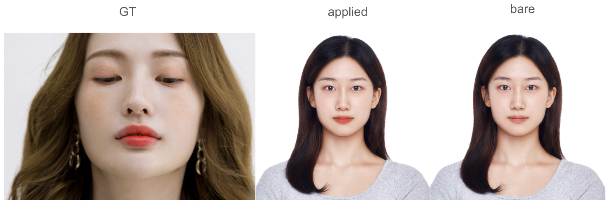
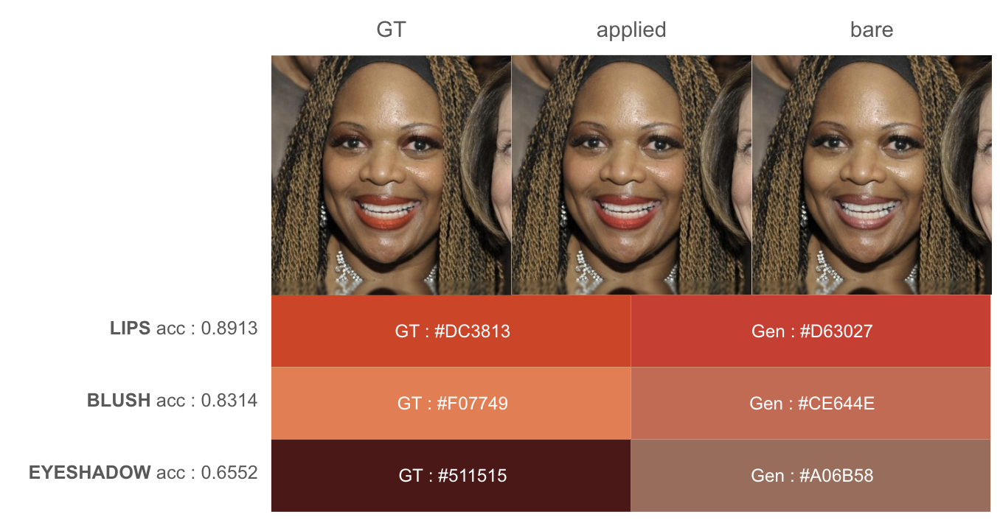
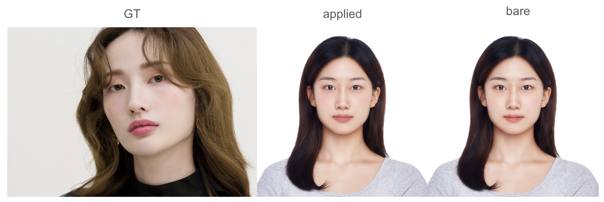

#  Fine-tuning VLMs via GRPO for Automatic Makeup Extraction
🌎 **This is a project done during my internship at [B*Factory](https://www.linkedin.com/company/bfactory-ai/posts/?feedView=all) | Jun 2025 - Aug 2025**<br>
📍 Special thanks to senior developers **Adrià Arrufat** and **Saad Imran** for their support and guidance throughout this project. <br>

This project aims to automatically extract makeup looks from company photoshoots and allow customers to easily try them on their own faces using LViton’s virtual try-on system.<br>( Note: The LViton codes and implementation details are proprietary and kept private. This repository only contains the research and training code for the makeup extraction component.) <br>

The core idea is to fine-tune a Vision-Language Model (VLM) via [GRPO (Generative Reinforcement Policy Optimization)](https://arxiv.org/abs/2402.03300) to predict makeup attributes (lip, blush, eyeshadow colors) of a makeup picture in a structured JSON format.  e.g.: 
```
[
  {"shape": "LIP_FULL_BASIC", "color": "#DC3813"},
  {"shape": "BLUSHER_CENTER_WIDE_BASIC", "color": "#F07749"},
  {"shape": "EYESHADOW_OVEREYE_FULL_BASIC", "color": "#511515"}
]
```
<br>

Since a complete makeup look involves many parameters, the training was conducted progressively: <br>
Starting with **lips only** (simpler) ➡️ and later extending to **lips, blush, and eyeshadow.** <br><br>


## ⚙️ Experimental Settings
### Data
- Dataset size: 10K
- Paired dataset of company's internal makeup parameters  + [FFHQ](https://github.com/NVlabs/ffhq-dataset)
### Base Model
- [Qwen2.5-VL-7B-Instruct](https://huggingface.co/Qwen/Qwen2.5-VL-7B-Instruct)
### Reward
```
Reward = 0.3 * Format Reward + 1.0 * Accuracy Reward
```
- **Format Reward**
  - 1.0 if output matches required format (tags, valid JSON, schema)
  - 0.2 otherwise
- **Accuracy Reward**
  - Defined differently depending on task (see below) <br><br>


## 💄 Lips Only
### Reward
**✅ Color score (=Accuracy Reward)<br>**
Originally, the color score was defined as 
```
color_score = 1 - (normalized L1 distance in RGB space)
```
However, this made the model's predictions saturate to grayish colors (R ≈ G ≈ B).
This was because gray is a “safe” prediction since its L1 distance to most colors in RGB space is relatively small.<br>

To fix this, the color score was redefined in LAB space, which is closer to human perception of color differences.<br>

→ **Final definition of color score:**
```
color_score = 1 - (normalized L2 distance in LAB space)
```
<br>

**✅ Parameter Values**<br>
In order to minimize the number of parameters to train (because the base model was too small), I fixed the parameter values for each makeup region instead of learning them.
```
LIP_FULL_BASIC : { "alpha": 190, "sigma": 70, "gamma": 0, "split": 0 }
```
<br>

### Results
<br>
<br><br>

### Results on actual company photoshoots
<br>
<br><br>


## 🎨 Lips, Blush, Eyeshadow
### Reward

**✅ Accuracy Reward (F1-based)**<br>
For the accuracy reward, we first make a **similarity matrix S**:
```
S[i,j] = 0.7 * color_score + 0.3 * shape_score
```
- i : index for GT
- j : index for prediction
- **color_score** = 1 - (normalized L2 distance in LAB space)
- **shape_score** = 1.0 if same, 0.2 if different<br>


Based on the similarity matrix, we calculate the F1 score (=Accuracy Reward).
```
F1 = (2 * precision * recall) / (precision + recall)
```
- precision = # matched / len(predictions)
- recall = # matched / len(GT)
- Matched if similarity score ≥ τ (=0.6)<br><br>


**✅ Parameter Values**<br>
In order to minimize the number of parameters to train (because the base model was too small), we fixed the parameter values for each makeup region instead of learning them.
```
LIP_FULL_BASIC : { "alpha": 190, "sigma": 70, "gamma": 0, "split": 0 }
BLUSHER_CENTER_WIDE_BASIC : { "alpha": 80, "sigma": 200, "gamma": 0, "split": 0 }
EYESHADOW_OVEREYE_FULL_BASIC : { "alpha": 180, "sigma": 100, "gamma": 50, "split": 0 }
```
<br>

### Results
<br><br>

### Results on actual company photoshoots



